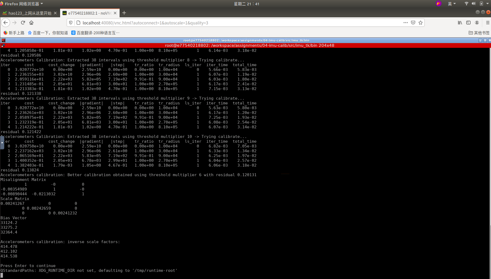
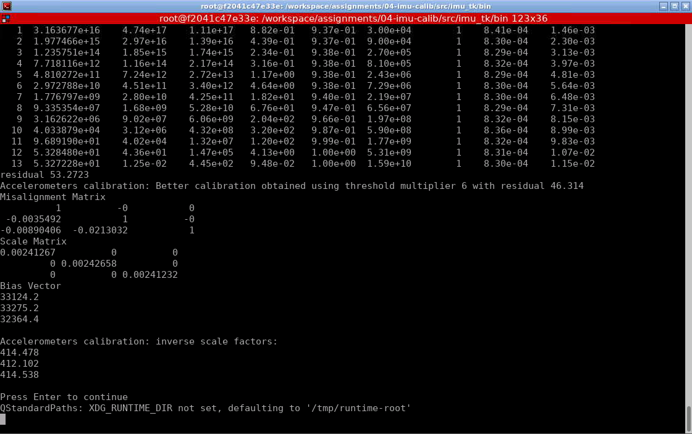

# Sensor Fusion: Lidar Odometry -- 多传感器融合定位与建图: 惯性导航原理

深蓝学院, 多传感器融合定位与建图, 第5章IMU Calib代码框架.

---

## Overview

按照作业要求，完成对不依赖转台标定方法的下三角内参模型的标定，并用解析式完成标定。

---

## homework

###  及格要求：完成雅克比推导, 且结果正确
推导过程见文件夹[点击链接进入](doc/)中的PDF文件《公式推导_代码版》

###  良好要求：完成新的内参模型下的标定, 且结果正确
需要在“calibration.cpp”中将12个状态变量的前三个设置为0，4到6设置为下三角对应的三个参数，结果如下图：

### 优秀要求：使用解析式求导完成标定, 且结果正确
在“calibration.cpp”中添加了ceres需要的MultiPosAccResidualAnalytic类，修改相应的残差及雅克比矩阵解析表达式，结果如下图：

